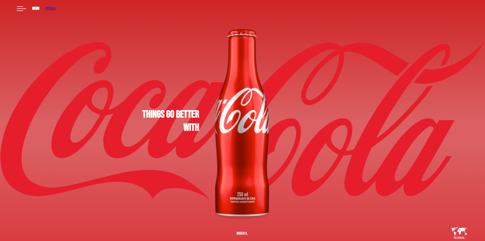
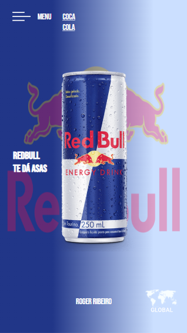

# COCA-COLA

Primeiro website criado, do tipo landing page, para treino no desenvolvimento de sites.
O site foi desenvolvido utilizando boas práticas, como por exemplo tags semânticas e responsividade.
 
 ## Tecnologias 
 * HTML
 * CSS
 * Media Queries

## REDBULL

Segunda página, entretanto utilizando display GRID ao inves de FLEX
 
 ## Tecnologias 
 * HTML
 * CSS
 * Media Queries

 ## Autor do projeto
 [Roger R.](https://www.linkedin.com/in/roger-r-de-oliveira-890923353/)